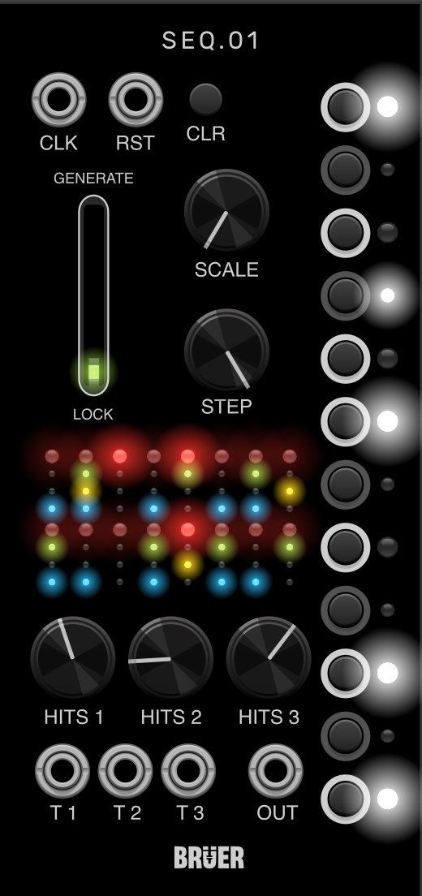

# BRUER
# BRUER

Generative modules for VCV Rack.

SEQ1 is available in the VCV Library.

Source:
https://github.com/bruer80/bruer-vcv

Support development:
https://buymeacoffee.com/bruer

## SEQ1

SEQ1 is a compact generative sequencer combining a Turing machine, an integrated quantizer and three Euclidean trigger generators.

### Features

* Turing machine inspired shift register
* Integrated note quantizer
* User-selectable scale
* Variable sequence length
* Octave range control
* Three Euclidean trigger outputs
* Independent Euclidean shifts
* Reset and Clear functions

### Controls

* Generate
* Length
* Scale
* Euclidean 1
* Euclidean 2
* Euclidean 3
* Shift 1
* Shift 2
* Shift 3
* Note selection

### Roadmap

Future ideas currently under consideration:

- CV control over Euclidean shifts
- SEQ1 expander
- Additional modulation inputs

### Credits

SEQ1 was developed using the VCV Rack SDK and draws inspiration from several open-source VCV Rack modules, including:

- VCV Quantizer
- RareBreeds Eugene
- Turing Machine-inspired sequencers from the VCV Rack ecosystem

Many thanks to the original developers for making their work available to the community.
